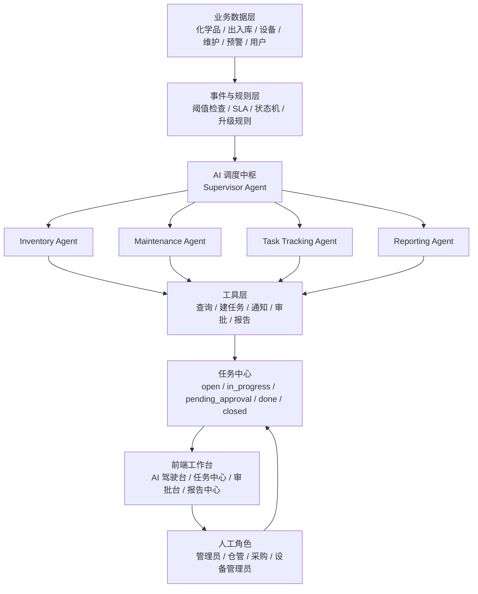

# LabManager AI 员工设计文档

## 1. 文档目标

本文档用于定义 LabManager 中“AI 员工”模块的产品定位、系统架构、任务流转、数据对象、界面设计与分阶段实施方案。

设计目标不是增加一个独立的聊天页，而是在现有实验室物料管理系统中引入一个可监督、可执行、可追踪的流程代理，使其能够围绕库存、维护、预警和任务流转承担“数字员工”的职责。

本文档聚焦以下问题：

- AI 员工在系统中的职责边界是什么
- AI 员工如何与现有化学品、出入库、设备、维护、预警模块联动
- AI 员工应如何形成“发现问题 -> 创建任务 -> 跟进处理 -> 审批升级 -> 结果归档”的闭环
- 首个可落地版本应包含哪些能力，哪些能力应暂缓

## 2. 产品定位

### 2.1 角色定义

AI 员工不是单纯的问答助手，而是一个围绕实验室运营结果负责的流程协调员。

在 LabManager 场景中，AI 员工的职责建议定义为：

1. 日常巡检
   - 定时检查低库存化学品、超期维护设备、异常设备、缺失记录等问题
2. 任务生成
   - 根据规则和分析结果自动创建补货、维护、排查、汇总等任务
3. 流程跟进
   - 跟踪任务状态、提醒责任人、对超时任务升级处理
4. 决策辅助
   - 生成补货建议、维护优先级建议、异常解释、日报与周报
5. 审批协同
   - 对高风险动作发起审批请求，不直接越权执行

### 2.2 不应承担的职责

为了保证上线风险可控，AI 员工在首阶段不应承担以下职责：

- 直接修改核心业务数据而不留痕
- 无审批自动发起采购或停用设备
- 用自由对话替代规范流程
- 在缺乏规则约束时自主决定高风险业务动作

### 2.3 设计原则

- 以任务为中心，不以对话为中心
- 以规则 + Agent 混合驱动，不让模型裸奔
- 低风险动作可自动执行，高风险动作必须审批
- 所有判断与动作必须可审计、可回溯
- 先做可监督的半自动员工，再逐步放权

## 3. 总体架构

### 3.1 架构分层

AI 员工建议采用“感知、判断、执行、复盘”四层闭环架构。

#### A. 感知层

负责读取系统中的事实数据，包括：

- 化学品档案与库存
- 出入库记录
- 设备档案与状态
- 维护记录
- 预警规则与阈值
- 用户、角色与审批信息
- 任务历史和操作日志

#### B. 判断层

由规则引擎与 Agent 共同完成：

- 规则引擎负责硬约束判断
  - 例如低于阈值即告警、超期即升级、存在未关闭任务则不重复创建
- Agent 负责语义判断与建议生成
  - 例如异常消耗解释、任务优先级建议、日报摘要生成

#### C. 执行层

AI 员工通过受控工具完成动作，而不是直接操作底层数据：

- 创建任务
- 分配责任人
- 发送提醒
- 发起审批
- 更新任务状态
- 生成报告

#### D. 复盘层

所有动作都要沉淀为可追溯记录，用于：

- 审计
- 管理复盘
- 策略优化
- 后续模型调优

### 3.2 逻辑架构图

## 4. 核心能力设计

### 4.1 日常巡检能力

AI 员工应支持基于定时任务的自动巡检，建议首批覆盖以下场景：

1. 低库存巡检
   - 检查当前库存是否低于默认阈值或单独阈值
2. 超期维护巡检
   - 检查设备最近维护时间是否超出维护周期
3. 异常设备巡检
   - 检查设备状态是否为故障、维护中或其他异常状态
4. 数据完整性巡检
   - 检查缺少图片、缺少维护记录、缺少供应商或编号等信息

### 4.2 任务生成能力

AI 员工必须围绕任务工作，而不是只输出建议文本。

建议支持的任务类型包括：

- `restock`
  - 补货任务
- `maintenance`
  - 维护任务
- `anomaly_review`
  - 异常排查任务
- `data_fix`
  - 数据补录任务
- `report`
  - 日报/周报生成任务

### 4.3 流程跟进能力

AI 员工创建任务后，需要持续跟进其生命周期：

1. 检查任务是否被接收
2. 判断是否超过 SLA
3. 超时后执行催办
4. 连续超时则升级提醒
5. 处理完成后自动归档

### 4.4 决策辅助能力

在不越权执行的前提下，AI 员工应输出结构化建议：

- 低库存补货建议
- 设备维护优先级建议
- 异常设备排查建议
- 周期性运营摘要
- 风险变化说明

### 4.5 审批协同能力

对高风险或涉及外部动作的事项，AI 员工只能发起审批，不能直接执行。

建议以下操作纳入审批：

- 发起采购申请
- 调整库存阈值
- 标记设备停用
- 批量关闭异常任务
- 改写关键业务配置

## 5. Agent 角色设计

为了降低复杂度，不建议首版实现一个全能单体 Agent，而建议采用“总控 + 专项 Agent”的结构。

### 5.1 Supervisor Agent

职责：

- 统一接收巡检事件
- 判断应由哪个专项 Agent 处理
- 合并结论并决定是否建任务、是否升级、是否发起审批

### 5.2 Inventory Agent

职责：

- 读取库存、阈值、出入库记录
- 识别低库存或异常消耗
- 生成补货建议
- 跟踪补货相关任务

### 5.3 Maintenance Agent

职责：

- 读取设备状态与维护历史
- 识别超期维护和异常设备
- 生成维护或排查任务
- 输出维护优先级建议

### 5.4 Task Tracking Agent

职责：

- 跟踪未关闭任务
- 计算 SLA
- 执行催办和升级
- 汇总任务进展

### 5.5 Reporting Agent

职责：

- 汇总日报、周报、专题报告
- 生成面向管理员的运营摘要
- 汇总本周期新增风险、已完成任务和待决事项

## 6. 工具层设计

AI 员工不得直接访问底层表结构进行任意写入，应通过明确边界的工具接口工作。

建议首批提供以下工具能力：

- `list_low_stock_items()`
- `list_overdue_equipment()`
- `list_fault_equipment()`
- `list_open_tasks(filters)`
- `create_task(input)`
- `update_task_status(taskId, status)`
- `assign_task(taskId, assignee)`
- `request_approval(input)`
- `send_notification(input)`
- `generate_report(input)`
- `get_task_history(taskId)`

设计要求：

- 工具入参必须结构化
- 工具返回结果必须可记录
- 所有写操作必须带操作者上下文
- 工具调用失败要有明确错误码和可见日志

## 7. 任务中心设计

### 7.1 任务状态

建议统一使用以下状态模型：

- `open`
  - 已创建，待认领或待处理
- `in_progress`
  - 已开始处理
- `pending_approval`
  - 等待人工审批
- `done`
  - 已完成，待归档
- `closed`
  - 已关闭或归档

### 7.2 优先级

建议采用三档优先级：

- `P0`
  - 影响安全、关键设备、关键物料供应
- `P1`
  - 影响正常运营效率
- `P2`
  - 数据治理、补录、低风险优化项

### 7.3 通用流程

一条标准任务流建议如下：

1. 巡检或用户触发发现问题
2. 规则判断是否已有同类未关闭任务
3. 若无，则 AI 创建任务
4. AI 写入任务原因、证据与建议
5. 分配责任角色或责任人
6. 跟踪处理进度
7. 若超时则催办或升级
8. 若涉及高风险动作则进入审批
9. 完成后归档并记录结果

## 8. 数据模型建议

### 8.1 `ai_tasks`

用于记录 AI 发起或跟进的任务主体。

建议字段：

- `id`
- `task_type`
- `source_type`
- `source_id`
- `title`
- `description`
- `priority`
- `status`
- `assignee_role`
- `assignee_user_id`
- `due_at`
- `risk_level`
- `requires_approval`
- `created_by`
- `created_at`
- `updated_at`

### 8.2 `ai_task_actions`

用于记录 AI 和人工对任务执行的动作历史。

建议字段：

- `id`
- `task_id`
- `action_type`
- `actor_type`
- `actor_id`
- `reason`
- `tool_name`
- `result_snapshot`
- `created_at`

### 8.3 `ai_memories`

用于存储长期规则、策略和经验性信息。

建议字段：

- `id`
- `memory_type`
- `scope`
- `key`
- `value`
- `updated_at`

### 8.4 `approvals`

用于记录审批请求和审批结果。

建议字段：

- `id`
- `target_type`
- `target_id`
- `approval_type`
- `status`
- `requested_by`
- `approved_by`
- `approved_at`
- `comment`

### 8.5 与现有模块的关系

- 化学品和库存模块提供补货任务的数据来源
- 设备和维护模块提供维护任务的数据来源
- 预警中心是 AI 任务的显式入口
- 系统设置提供阈值、周期和策略配置

## 9. 前端界面设计

AI 员工不应只存在于当前 `AIAnalysis` 页面，而应扩展为一组运营工作台界面。

### 9.1 AI 驾驶台

页面目标：

- 展示 AI 今日发现的问题
- 展示 AI 今日创建和跟进的任务
- 展示待审批和超时事项
- 呈现 AI 建议动作

建议模块：

- 今日风险统计卡
- AI 今日新建任务数
- 待审批任务数
- 超时任务数
- AI 建议动作列表
- 最近活动时间线

### 9.2 AI 任务中心

页面目标：

- 集中查看 AI 相关任务
- 支持筛选、搜索、分配、状态更新和详情查看

建议能力：

- 按类型、优先级、状态、责任人筛选
- 列表显示来源、截止时间、最近动作、风险等级
- 详情抽屉显示任务原因、建议、审批记录、动作日志

### 9.3 AI 审批台

页面目标：

- 集中处理 AI 发起的审批事项

建议能力：

- 待审批列表
- 风险说明
- AI 建议动作
- 批准、驳回、退回补充信息

### 9.4 AI 报告中心

页面目标：

- 汇总 AI 自动生成的日报、周报和专题报告

建议能力：

- 日报列表
- 周报列表
- 风险专题报告
- 导出能力

### 9.5 与现有页面的联动建议

- `Dashboard`
  - 增加“AI 今日工作摘要”
- `AlertCenter`
  - 支持从预警项一键生成 AI 任务
- `ChemicalInventory`
  - 支持查看 AI 补货建议与相关任务
- `MaintenanceRecords`
  - 支持查看 AI 维护建议与相关任务
- `SystemSettings`
  - 增加 AI 策略、阈值、审批规则配置入口

## 10. 权限与风险控制

### 10.1 权限等级建议

建议将 AI 动作权限分为四级：

1. 只读分析
   - 仅查看和总结，不执行任何动作
2. 建议执行
   - 生成建议和任务草案，由人工确认
3. 低风险自动执行
   - 允许自动发提醒、自动建任务、自动催办
4. 高风险审批执行
   - 采购、阈值修改、设备停用等动作必须审批

### 10.2 风险边界

以下风险边界建议在首版严格执行：

- 不允许 AI 直接修改库存数量
- 不允许 AI 直接写入维护完成结果
- 不允许 AI 绕过权限系统分配任务
- 不允许 AI 跳过审批执行外部动作

### 10.3 审计要求

每个动作都必须能回答：

- 为什么执行
- 依据了哪些数据
- 用了哪些规则
- 调用了哪个工具
- 结果是什么
- 是否有人审批

## 11. V1 实施范围

### 11.1 V1 目标

实现一个“实验室运营 AI 协调员”，能够在库存和维护场景中主动发现问题、自动建任务、跟进处理并输出周期汇总。

### 11.2 V1 必做范围

1. 定时巡检
   - 低库存巡检
   - 超期维护巡检
   - 异常设备巡检
2. 任务中心
   - AI 任务创建、列表、状态流转、详情展示
3. 提醒与升级
   - SLA 超时提醒
   - 任务升级机制
4. 审批基础能力
   - 待审批状态
   - 审批记录
5. 周期报告
   - AI 日报
   - AI 周报

### 11.3 V1 暂不包含

- 自由聊天式通用 AI 员工
- 自动采购下单
- 自动停用设备
- 复杂预测模型
- 自主跨多日规划和连续执行

## 12. 分阶段实施建议

### 阶段一：任务中枢

目标：

- 建立 AI 任务数据结构、状态机和任务中心页面

交付内容：

- `ai_tasks`、`ai_task_actions`、`approvals` 基础表
- AI 任务中心列表与详情抽屉
- 任务状态流转能力

### 阶段二：规则触发

目标：

- 接通现有预警和维护规则，形成自动建任务闭环

交付内容：

- 低库存任务生成
- 超期维护任务生成
- 异常设备任务生成

### 阶段三：AI 说明与建议

目标：

- 让任务不仅被创建，还要有可读的解释和建议

交付内容：

- 任务原因说明
- 风险等级建议
- 处理建议摘要

### 阶段四：审批与催办

目标：

- 增强流程执行能力，建立监督闭环

交付内容：

- 待审批任务
- 审批流转
- 自动催办与升级逻辑

### 阶段五：报告中心

目标：

- 建立 AI 员工的管理可见性和复盘能力

交付内容：

- AI 驾驶台
- 日报和周报
- 风险汇总视图

## 13. 与当前前端现状的结合建议

结合当前项目结构，建议优先按以下顺序改造：

1. 将现有 `AIAnalysis` 从静态分析页升级为 AI 驾驶台入口
2. 新增 AI 任务中心页面，并在 `AlertCenter` 中接入“生成任务”
3. 在 `Dashboard` 中加入 AI 今日摘要卡片
4. 在 `ChemicalInventory` 和 `MaintenanceRecords` 中增加任务联动入口
5. 在 `SystemSettings` 中补充 AI 规则与审批策略设置

## 14. 验收标准

首版 AI 员工建议按以下标准验收：

1. AI 能按计划巡检并识别出低库存、超期维护和异常设备
2. AI 能避免重复创建同类未关闭任务
3. AI 创建的任务包含原因、优先级、建议动作和责任对象
4. AI 能对超时任务执行提醒或升级
5. 高风险动作会进入审批，而不会被自动执行
6. 管理员能在界面中查看 AI 的动作历史和判断依据
7. AI 能自动生成日报或周报，且内容基于真实系统数据

## 15. 总结

LabManager 的 AI 员工应被设计为一个围绕任务与流程负责的数字协调员，而不是独立的聊天功能。其价值不在于“能回答多少问题”，而在于“能否持续发现问题、推动流程、留下记录并对结果负责”。

在实现路径上，建议始终坚持：

- 先任务闭环，后自由对话
- 先低风险自动化，后高风险放权
- 先规则明确，后增强智能

只要先把“巡检 -> 建任务 -> 跟进 -> 审批 -> 报告”这条主链路跑通，AI 员工就已经具备真实上岗价值。
