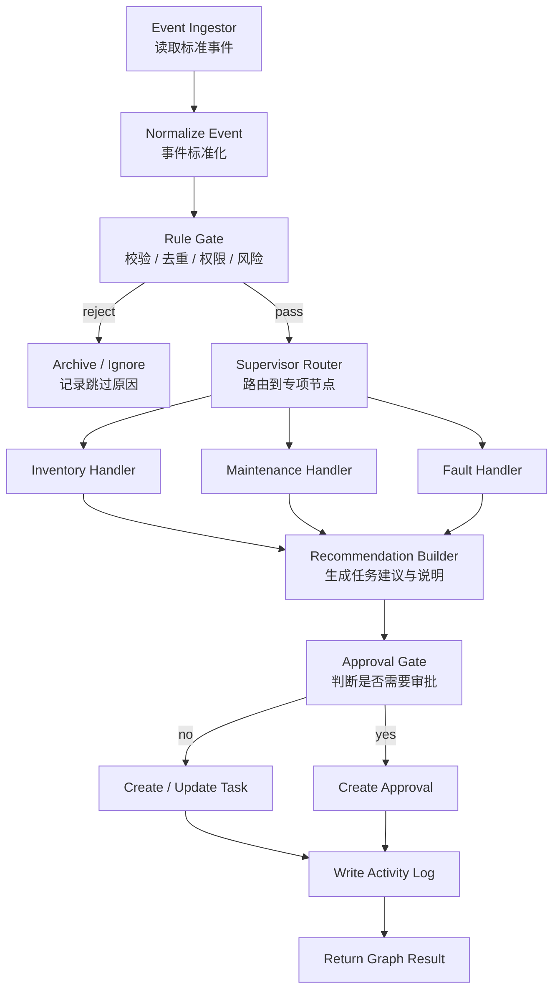

# LabManager AI 员工 LangGraph 节点设计

## 1. 目标

本文档将现有 Agent 架构改写为可落地的 LangGraph 编排设计，用于后端真实流程实现。

设计目标：

- 以状态图组织 AI 员工流程
- 规则节点与 LLM 节点分离
- 所有写操作通过工具层执行
- 所有关键动作留痕
- 支持人工审批与人工接管

---

## 2. 设计原则

- LangGraph 负责流程编排，不替代业务规则
- 规则判断优先使用确定性代码节点
- LLM 节点只负责解释、建议、摘要和报告
- Agent 不直接操作数据库
- 每次流转都写入结构化状态与动作日志

---

## 3. V1 节点图



---

## 4. State 结构

## 4.1 顶层 State

```ts
type LabAgentState = {
  runId: string
  now: string
  actor: {
    type: 'system' | 'user' | 'agent'
    id: string
    name: string
  }
  event: AIEventPayload | null
  context: DomainContext
  decision: DecisionState
  taskDraft: TaskDraft | null
  approvalDraft: ApprovalDraft | null
  toolResults: ToolExecutionRecord[]
  logs: ActivityDraft[]
  output: GraphOutput | null
  errors: GraphError[]
}
```

## 4.2 事件对象

```ts
type AIEventPayload = {
  id: string
  type: 'low_stock' | 'maintenance_overdue' | 'equipment_fault'
  sourceType: 'chemical' | 'equipment'
  sourceId: string
  sourceName: string
  title: string
  summary: string
  priority: 'P0' | 'P1' | 'P2'
  riskLevel: 'high' | 'medium' | 'low'
  evidence: string[]
  metadata: Record<string, unknown>
  createdAt: string
}
```

## 4.3 上下文对象

```ts
type DomainContext = {
  chemical?: {
    currentStock?: number
    threshold?: number
    recentMovements?: Array<Record<string, unknown>>
  }
  equipment?: {
    status?: string
    lastMaintenanceAt?: string | null
    overdueDays?: number
    recentMaintenance?: Array<Record<string, unknown>>
  }
  existingOpenTask?: {
    id: string
    status: string
    assignee?: string
  } | null
  relatedApproval?: {
    id: string
    status: string
  } | null
}
```

## 4.4 决策对象

```ts
type DecisionState = {
  isValidEvent: boolean
  dedupeHit: boolean
  route: 'inventory' | 'maintenance' | 'fault' | 'ignore' | null
  requiresApproval: boolean
  shouldCreateTask: boolean
  shouldNotifyOnly: boolean
  reasonCodes: string[]
}
```

## 4.5 任务草案与审批草案

```ts
type TaskDraft = {
  type: 'restock' | 'maintenance' | 'anomaly_review'
  title: string
  summary: string
  recommendation: string
  priority: 'P0' | 'P1' | 'P2'
  riskLevel: 'high' | 'medium' | 'low'
  assigneeRole: string
  sourceType: 'chemical' | 'equipment'
  sourceId: string
  dueAt: string
}

type ApprovalDraft = {
  title: string
  reason: string
  riskLevel: 'high' | 'medium' | 'low'
  targetType: 'task'
  targetTempRef: string
}
```

## 4.6 输出对象

```ts
type GraphOutput = {
  status: 'task_created' | 'approval_created' | 'ignored' | 'failed'
  taskId?: string
  approvalId?: string
  summary: string
}
```

---

## 5. 节点职责拆解

## 5.1 Event Ingestor

- 输入：规则层或人工触发的标准事件
- 输出：写入 `state.event`
- 说明：不做复杂判断，只负责进入图

## 5.2 Normalize Event

- 输入：原始事件
- 输出：标准化事件结构
- 规则：
  - 补齐默认优先级
  - 补齐默认风险等级
  - 统一来源对象字段

## 5.3 Rule Gate

- 职责：
  - 检查事件是否完整
  - 检查是否已存在未关闭任务
  - 检查是否属于允许自动处理范围
  - 给出 `requiresApproval / shouldCreateTask`
- 实现方式：纯代码节点

## 5.4 Supervisor Router

- 职责：按事件类型分派处理节点
- 路由规则：
  - `low_stock -> Inventory Handler`
  - `maintenance_overdue -> Maintenance Handler`
  - `equipment_fault -> Fault Handler`
  - 无法识别 -> ignore
- 实现方式：纯代码节点

## 5.5 Inventory Handler

- 输入：低库存事件 + 化学品上下文
- 输出：补货任务草案
- 典型结果：
  - `task.type = restock`
  - 指派给采购或库管

## 5.6 Maintenance Handler

- 输入：超期维护事件 + 设备维护历史
- 输出：维护任务草案
- 典型结果：
  - `task.type = maintenance`
  - 指派给设备管理员

## 5.7 Fault Handler

- 输入：异常设备事件 + 设备状态
- 输出：异常排查任务草案
- 典型结果：
  - `task.type = anomaly_review`
  - 高风险时进入审批门禁

## 5.8 Recommendation Builder

- 职责：
  - 生成任务摘要
  - 生成原因说明
  - 生成建议动作
- 实现方式：
  - V1 可先模板化
  - 后续再切换到 LLM 节点

## 5.9 Approval Gate

- 职责：判断是否要走审批
- 典型条件：
  - 高风险事件
  - 关键设备异常
  - 需要停用、冻结、修改策略的动作
- 实现方式：纯代码节点

## 5.10 Create / Update Task

- 职责：
  - 调用 `create_task`
  - 或复用已有开放任务
- 要求：
  - 只能通过工具层
  - 返回任务 ID 与结果快照

## 5.11 Create Approval

- 职责：
  - 调用 `request_approval`
  - 将任务置为 `pending_approval`
- 要求：
  - 审批结果和任务强绑定

## 5.12 Write Activity Log

- 职责：记录本次图执行的关键动作
- 写入内容：
  - 触发事件
  - 路由决策
  - 创建任务 / 审批结果
  - 失败原因

---

## 6. 工具层接口建议

```ts
list_low_stock_items(input): Promise<...>
list_overdue_equipment(input): Promise<...>
list_fault_equipment(input): Promise<...>
get_open_task_by_source(input): Promise<...>
create_task(input): Promise<{ taskId: string }>
assign_task(input): Promise<{ success: boolean }>
update_task_status(input): Promise<{ success: boolean }>
request_approval(input): Promise<{ approvalId: string }>
write_activity_log(input): Promise<{ success: boolean }>
generate_report(input): Promise<{ reportId: string }>
```

约束：

- Agent 不得直接写表
- 每个工具调用必须带 `runId`
- 所有写操作必须可审计

---

## 7. LangGraph 实施分层

## 7.1 第一层：纯规则图

范围：

- Event Ingestor
- Normalize Event
- Rule Gate
- Supervisor Router
- Create Task / Create Approval
- Write Activity Log

目标：

- 跑通真实主链路
- 不依赖 LLM

## 7.2 第二层：混合图

新增：

- Recommendation Builder 切 LLM
- 报告摘要节点切 LLM

目标：

- 保持执行确定性
- 引入解释和总结能力

## 7.3 第三层：多 Agent 图

新增：

- Task Tracking Agent 图
- Reporting Agent 图
- Memory 回写节点

目标：

- 支持催办、升级、复盘

---

## 8. 可执行实施任务拆解

## 8.1 P0

- 定义 LangGraph 顶层 `State`
- 定义标准事件对象和上下文对象
- 实现 `Normalize Event`
- 实现 `Rule Gate`
- 实现 `Supervisor Router`
- 实现三类 handler
- 对接 `create_task / request_approval / write_activity_log`
- 跑通“事件 -> 任务/审批 -> 日志”链路

## 8.2 P1

- 引入 Recommendation Builder 的 LLM 版本
- 引入 Task Tracking 子图
- 引入 Reporting 子图
- 接入 SLA 超时与升级逻辑

## 8.3 P2

- 接入 Memory 读写
- 接入数据完整性巡检
- 接入更复杂的异常解释与策略优化

---

## 9. 不建议的实现方式

- 不要把去重、权限、审批门禁交给 LLM 判断
- 不要让每个专项 Agent 直接写数据库
- 不要一开始就做自由对话入口驱动图执行
- 不要在图里塞太多 UI 逻辑

---

## 10. V1 验收标准

- 三类事件都能进入图
- 未关闭任务能被正确判重
- 低风险事件可自动建任务
- 高风险事件可发起审批
- 关键动作均写入活动日志
- 任意一次图执行都可根据 `runId` 回溯
