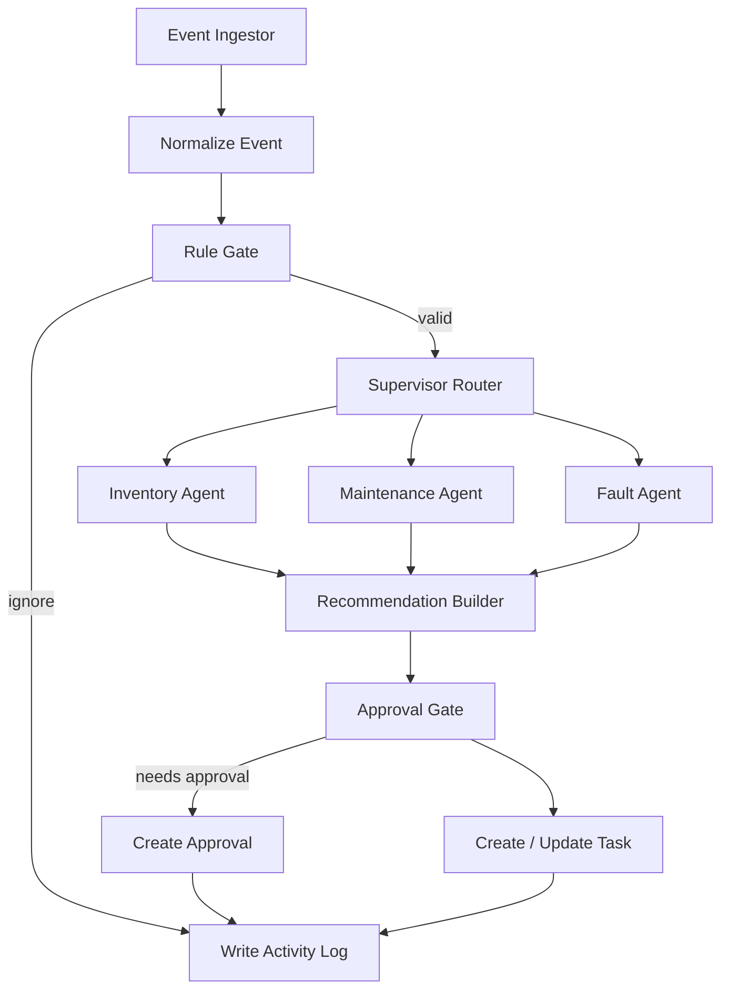

# LabManager Agent Architecture V1

本文档定义 LabManager Python 后端第一版智能体架构。V1 的目标不是自由聊天式 AI 助手，而是面向实验室流程的可审计 Agent 编排链路。

## 1. Architecture Goal

V1 形成一条稳定主链路：

```text
巡检事件 -> 规则门禁 -> Supervisor 分派 -> 专项 Agent -> 任务/审批/日志 -> 报告/记忆
```

Agent 在这里表示有明确职责、输入输出、工具权限和审计记录的流程角色。Agent 不能直接写数据库，只能通过工具层执行副作用。

## 2. Runtime Shape

Python 后端以 LangGraph Supervisor Graph 作为主编排入口：



## 3. V1 Agent Roles

### Supervisor Router

职责：

- 根据事件类型、优先级、风险等级选择专项 Agent。
- 决定队列语义：`routine`、`priority`、`urgent`、`background`。
- 不直接创建任务、审批或日志。

### Inventory Agent

职责：

- 处理 `low_stock` 事件。
- 生成补货任务草稿。
- 给出补货原因、建议责任角色、证据摘要。

### Maintenance Agent

职责：

- 处理 `maintenance_overdue` 事件。
- 生成维护跟进任务草稿。
- 判断是否需要升级到设备管理员。

### Fault Agent

职责：

- 处理 `equipment_fault` 事件。
- 生成异常设备复核任务草稿。
- 默认进入较高风险处理路径，可触发审批门禁。

### Reporting Agent

职责：

- 汇总任务、审批和活动日志。
- 生成日报/周报。
- 可使用 LLM 生成自然语言摘要，但不能改写事实统计。

## 4. Pure Code Gates

以下节点必须保持纯代码，不由 LLM 决策：

- 事件字段校验
- 事件类型合法性
- 任务判重
- 权限判断
- 审批门禁
- 任务状态机
- SLA 判断

## 5. Allowed LLM Usage

LLM 只能出现在低风险解释型节点：

- 任务原因说明
- 风险解释
- 推荐动作摘要
- 报告自然语言总结
- 复盘建议

LLM 输出必须被包进审计记录，且不能绕过规则门禁和工具层。

## 6. Migration Path

1. 保持 `/api/ai` 兼容层作为前端唯一入口。
2. 用 capability flags 把 `rules/execute` 切到 Python Supervisor Graph。
3. 将任务、审批、日志副作用逐步接入正式工具层。
4. 每个能力迁移前后都运行契约测试。
5. fallback 保留到该能力 parity 验证通过为止。

## 7. Definition of Done

V1 智能体架构成立的最低标准：

- Supervisor Graph 覆盖三类 V1 事件。
- 专项 Agent 输出稳定 task draft。
- 审批门禁由纯代码节点决定。
- 所有副作用通过 tool/service 层。
- 每次执行产生活动日志草稿或实际日志。
- `/api/ai/rules/execute` 可以通过 graph 返回 `taskId` 或 existing task。
