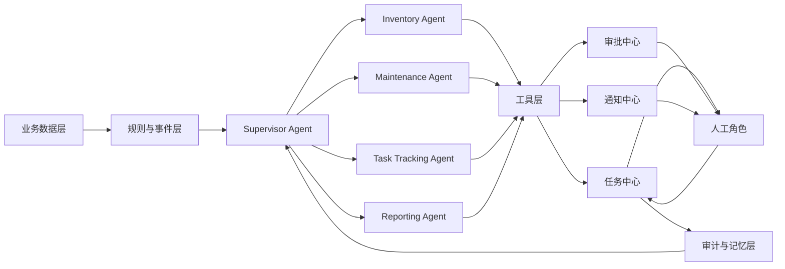

# 工作流

## 1. agents架构

系统：
先从**业务数据层**读取库存、设备、维护、任务等数据，
再通过**规则与事件层**识别出异常情况，比如低库存、超期维护、任务超时等。

这些问题会统一交给 **Supervisor Agent**，它相当于 AI 员工的总控大脑，负责判断问题类型，并分派给不同的专项 Agent 去处理。
比如，
	库存问题交给 **Inventory Agent**，
	维护问题交给 **Maintenance Agent**，
	流程跟踪交给 **Task Tracking Agent**，
	汇总分析交给 **Reporting Agent**。

各个 Agent 不直接操作系统，而是通过工具层去调用能力，比如建任务、发提醒、发起审批、生成报告。
之后，
任务会进入**任务中心**，
高风险事项进入**审批中心**，
提醒进入**通知中心**，
再由仓管、采购、设备管理员等**人工角色**处理。

人工处理后的结果再回到系统，沉淀到审计与记忆层，形成日志、历史和经验，供下一轮 AI 判断继续使用。
## 2. 工作流节点

![[mermaid-diagram-2026-04-15-132936.png|434]]

## 3. 各节点实现方式

### 3.1 业务数据层

这一层的职责是把库存、设备、维护记录、任务状态、审批结果等业务信息统一收集起来，并整理成可被后续节点直接理解的数据对象。

实现时可以按下面的方式设计：

- 先定义清晰的数据范围，例如“库存状态”“设备状态”“维护计划”“任务进度”“人员处理结果”。
- 对不同来源的数据做统一口径处理，保证名称、状态、时间、责任人等字段含义一致。
- 对关键字段做基础校验，避免缺失值、重复记录、时间冲突进入后续流程。
- 保留原始记录和标准化后的记录，既方便追溯，也方便 Agent 直接消费。
- 为规则与事件层提供“增量变化”而不只是“全量快照”，这样更容易识别异常和触发事件。

这一层的输出重点不是“展示数据”，而是形成一份可判断、可追溯、可继续流转的业务事实集合。

### 3.2 规则与事件层

这一层负责把“数据”转成“问题”或“机会”，也就是识别哪些情况值得系统采取动作。

实现时建议拆成两部分：

- 规则判断：根据预先定义好的业务条件判断，例如库存低于安全值、维护超过计划时间、任务超过处理时限。
- 事件生成：一旦命中规则，就生成标准事件，包含事件类型、严重程度、关联对象、触发原因、建议动作、触发时间。

为了让后续流程更稳定，这一层最好做到：

- 同一问题不要重复生成大量事件，要支持去重和合并。
- 事件要有优先级，区分普通提醒、需要尽快处理、必须人工审批等类别。
- 对暂时无法确认的问题，可标记为“待补充信息”，而不是直接进入执行。
- 给每个事件保留触发依据，便于人工回看“为什么会触发”。

这一层输出的是“结构化事件”，而不是松散提醒。

### 3.3 Supervisor Agent

Supervisor Agent 是总调度节点，核心职责不是亲自处理业务，而是决定“谁来处理、处理到什么程度、是否需要人介入”。

实现方式可以分成四步：

1. 接收规则与事件层输出的标准事件。
2. 根据事件类型、紧急程度、影响范围判断应该交给哪个专项 Agent。
3. 补充处理上下文，例如关联库存、历史维护记录、当前负责人、最近一次处理结果。
4. 设定处理边界，例如只允许生成建议、允许直接建任务、必须先走审批。

为了避免总控节点失控，建议它具备以下机制：

- 明确分派规则，保证同类事件尽量走同一条处理路径。
- 支持升级策略，专项 Agent 无法闭环时回退给 Supervisor 再次判断。
- 支持冲突协调，例如同一个设备同时触发维护和停用相关事件时，由它统一决策优先顺序。
- 保留分派理由，便于后续优化判断逻辑。

### 3.4 Inventory Agent

Inventory Agent 负责处理库存相关事件，目标是把“库存异常”转成明确的执行动作。

它的实现可以围绕下面几个能力展开：

- 判断异常类型，例如低库存、超储、临期、长期未动、出入库不一致。
- 结合业务上下文给出处理建议，例如补货、调拨、盘点、冻结出库、人工确认。
- 判断是否能自动进入任务中心，还是需要先进入审批中心。
- 跟踪处理进度，直到库存风险解除或转入人工兜底。

一个比较实用的处理方式是：

1. 先确认异常是否真实存在。
2. 再判断影响范围和紧急程度。
3. 生成可执行动作和责任对象。
4. 推送到任务、审批或通知节点。
5. 等待处理结果并复核状态是否恢复正常。

这样它就不是“只会提醒库存不足”，而是能推动库存问题真正闭环。

### 3.5 Maintenance Agent

Maintenance Agent 负责设备维护相关事项，核心是把“维护计划”和“设备实际状态”对齐。

实现时可以让它承担这些职责：

- 识别维护到期、维护逾期、重复报修、维修后未验收等问题。
- 结合设备等级、使用频率、历史故障情况评估风险。
- 输出具体处理动作，例如安排检修、暂停使用、补充记录、触发复检。
- 在高风险情况下要求人工审批，避免系统直接推动敏感操作。

为了提升可执行性，这个 Agent 最好不仅看单次事件，还看设备生命周期中的连续状态，例如：

- 最近是否频繁故障。
- 是否刚做过维护但问题仍反复出现。
- 当前是否处于关键业务时段，是否适合立即停机。

这样生成的动作建议会更贴近实际运营，而不是机械触发。

### 3.6 Task Tracking Agent

Task Tracking Agent 负责盯住流程是否真正往前走，避免任务创建后无人跟进。

它的实现重点可以放在：

- 检查任务是否已分配、是否被接受、是否超时、是否缺少处理结果。
- 对卡住的流程进行催办、升级或重新分派。
- 识别流程瓶颈，例如经常卡在审批、经常无人认领、经常反复退回。
- 把流程状态变更同步给相关角色，让每个人知道当前卡在哪一步。

这个节点特别适合采用“状态驱动”的实现思路：

- 每个任务都定义清晰状态。
- 每种状态都有最大停留时间和下一步动作。
- 一旦超过预期，就自动触发提醒、升级或重新路由。

这样它扮演的是流程管家，而不是单纯的消息提醒器。

### 3.7 Reporting Agent

Reporting Agent 不是只在最后出报表，它更适合承担“经营视角的总结与反馈”。

实现方式上可以包括：

- 汇总不同 Agent 的处理结果，形成库存、维护、任务、审批等维度的运行视图。
- 识别反复出现的问题，例如某类耗材经常短缺、某类设备经常逾期维护。
- 对管理者输出趋势、风险、执行效率和待改进点。
- 把结论反哺给规则与事件层，帮助后续优化触发条件和优先级。

为了让这个节点有实际价值，建议它输出的不只是数字，还包括：

- 本周期最值得关注的异常。
- 哪些问题已经闭环，哪些问题反复发生。
- 哪些流程环节拖慢了整体处理速度。
- 下一步应重点关注的人、设备、物料或流程。

### 3.8 工具层

工具层的作用是把 Agent 的判断转成标准动作接口，避免每个 Agent 都各自直接碰业务系统。

这一层实现时要强调“动作标准化”：

- 把常见动作抽象出来，例如创建任务、更新状态、发起审批、发送通知、写入日志、查询历史。
- 每个动作都定义清楚输入参数、执行前条件、执行后结果和失败反馈。
- 对高风险动作增加限制，避免 Agent 直接越权操作。
- 对外只暴露稳定能力，内部如何完成不影响上层协作。

这样做的好处是：

- 新增 Agent 时不用重复接入一遍底层能力。
- 更容易做权限控制、审计和失败兜底。
- 工具可以独立优化，而不影响业务节点逻辑。

### 3.9 任务中心

任务中心负责承接可执行事项，把 Agent 的建议变成可跟踪、可分派、可闭环的任务对象。

实现时建议具备这些要素：

- 每个任务都要有来源、责任人、截止时间、优先级、关联对象、处理要求。
- 支持任务拆分、转派、退回、完成、挂起等流转动作。
- 任务状态变化要能被 Task Tracking Agent 持续监控。
- 任务完成后要要求结果反馈，而不是只改一个“已完成”状态。

任务中心的关键不是“创建一条记录”，而是让后续任何人都能看清楚这件事是谁在做、做到哪一步、结果如何。

### 3.10 审批中心

审批中心负责承接高风险、高影响或超权限事项，核心是把“需要人拍板”的决策与普通执行动作分开。

实现方式上可以这样设计：

- 明确哪些场景必须审批，例如高价值采购、设备停用、关键库存冻结、异常报废。
- 每个审批事项都附带背景信息、风险说明、建议动作和影响范围。
- 审批结果不仅有“通过/拒绝”，还应支持“补充信息”“修改后再提”。
- 审批完成后自动把结果回传到任务中心或通知中心，继续后续动作。

审批中心的重点是保证决策透明和责任清晰，而不是增加流程负担。

### 3.11 通知中心

通知中心负责把系统判断和流程变化用合适的方式传达给合适的人。

实现时不要把它做成简单广播，而要做成“有目标、有时机、有回执”的提醒机制：

- 按角色、事项、紧急程度决定通知对象。
- 区分提醒、催办、升级、结果告知等不同通知类型。
- 控制频率，避免同一问题短时间内反复打扰。
- 对关键通知记录是否已送达、是否已查看、是否已有回应。

通知中心服务的是闭环效率，所以它的输出要尽量具体，直接告诉接收人“发生了什么、为什么需要你处理、下一步做什么”。

### 3.12 人工角色

人工角色是整个系统真正完成业务闭环的关键节点，因为很多判断最终仍然需要业务负责人确认或执行。

实现时要明确不同角色的责任边界，例如：

- 仓管负责库存确认、盘点、出入库调整。
- 采购负责补货与供应协调。
- 设备管理员负责维护安排、停用确认、维修验收。
- 管理者负责高风险审批和资源协调。

为了让人工处理更顺畅，系统提供给人工角色的信息应尽量完整：

- 事情是什么。
- 为什么触发。
- 建议怎么处理。
- 不处理会有什么影响。
- 处理后要回填什么结果。

人工角色不是系统的补丁，而是流程里被清晰设计出来的一环。

### 3.13 审计与记忆层

审计与记忆层负责沉淀“发生过什么、为什么这么做、结果怎么样”，既服务追责，也服务后续优化。

实现时建议分成两类内容：

- 审计内容：记录关键动作、审批意见、状态变化、责任归属、处理时间。
- 记忆内容：沉淀重复问题、有效处理经验、常见失败原因、推荐处理路径。

这一层发挥价值的方式主要有三种：

- 给管理者提供可追溯依据。
- 给 Agent 提供历史上下文，减少重复误判。
- 给规则与流程优化提供真实反馈。

如果没有这一层，系统每次都像第一次处理问题；有了这一层，系统才会越来越像一个真正积累经验的运营助手。

## 4. 节点之间的衔接原则

为了让整个工作流真正跑起来，而不是停留在概念图，节点之间建议统一遵循以下原则：

- 上一节点输出的内容，必须能成为下一节点的直接输入，避免人工二次整理。
- 每一次流转都要带上来源、原因、责任和当前状态，避免信息丢失。
- 自动处理和人工处理要有明确边界，避免系统越权，也避免所有事情都推给人。
- 每个节点都要有失败兜底策略，例如补充信息、人工接管、重新分派。
- 所有关键动作都要可追溯，方便后续复盘和优化。

按这个方式细化后，这张图就不只是“模块关系图”，而是可以继续展开为产品流程、页面结构和角色协作规则的基础。
